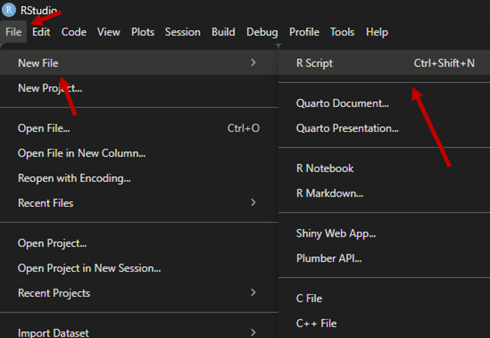

# Capa {.cover-slide background-color="#FFFFFF"}

::: cover-bg
:::

:::: cover-block
[OFICINA]{.cover-label}

::: cover-title
Introdução ao uso da linguagem de programação R para tratamento de grandes bases de dados georreferenciadas
:::
::::

## Apresentação {.smaller}
::::::::::: theme-section
:::::::::: columns
::::: {.column width="47%"}
::: bio-name
Clara Penz  
:::
[clarapenz@usp.br](mailto:clarapenz@usp.br){.bio-email}

::: bio-text
Geógrafa, mestranda em Geografia Humana pela USP; atua com metodologias quantitativas para mapeamento e análise de políticas públicas. Participa do projeto "Redes técnicas e digitalização do território nas favelas", desenvolvido pelo CEFAVELA (UFABC); atualmente é estagiária no Instituto de Estudos Brasileiros (USP) no acervo do Milton Santos.
:::
:::::
::: {.column width="6%"}
:::
::::: {.column width="47%"}
::: bio-name
João Victor Pavesi de Oliveira 
:::
[joao.pavesi@gmail.com](mailto:joao.pavesi@gmail.com){.bio-email}

::: bio-text
Geógrafo, com mestrado e doutorado em Geografia Humana pela USP; estuda políticas educacionais, direito à cidade e geografia da educação. Participante da Rede Escola Pública e Universidade (REPU); atualmente professor substituto no IFBA-Salvador.
:::
:::::
::::::::::
:::::::::::

# OFICINA {.green-slide background-color="#1B4332"}

:::: green-content
[OFICINA]{.cover-label}

::: theme-section
Introdução ao uso da linguagem de programação R para tratamento de grandes bases de dados georreferenciadas
:::
::::

## Objetivos

-   Compreender o que é uma linguagem de programação

-   Reconhecer os diferentes painéis do R

-   Conhecer as principais funções para trabalhar com tabelas

    ::::: columns
    ::: {.column width="50%"}
    -   Importação
    -   Visualização
    -   Estatística básica
    :::

    ::: {.column width="50%"}
    -   Filtro
    -   União
    -   Exportação
    :::
    :::::

::: {.fragment .text-right}
*E, principalmente...*
:::

::: {.fragment .text-right}
*perder o medo de programar!*
:::

## O que é uma linguagem de programação?

::::::::: theme-section
:::::::: columns
:::: {.column width="48%"}
::: def-card
**Algoritmo**

Sequência lógica de passos para realizar uma tarefa computacional
:::
::::

::: {.column width="4%"}
:::

:::: {.column width="48%"}
::: def-card
**Linguagem de programação**

Conjunto formal de símbolos e regras utilizado para criar algoritmos
:::
::::
::::::::
:::::::::

## Metáfora da receita de bolo

::::::::: theme-section
:::::::: r-stack
:::::: {.fragment .fade-out fragment-index="1"}
::::: columns
::: {.column width="50%"}
-   Ovos fresquinhos
-   Pitada de sal
-   Açúcar a gosto (mas não exagerar!)
-   Farinha soltinha
:::

::: {.column width="50%"}
-   Qualquer óleo vegetal
-   Forno já quente
-   Assar até a casa cheirar a bolo
:::
:::::
::::::

::: {.fragment fragment-index="1"}
1.  Pré-aqueça o forno a 180°C
2.  Bata 3 ovos com 200 g de açúcar por 3 minutos
3.  Adicione 100 ml de óleo vegetal e bata por mais 1 minuto
4.  Incorpore 250 g de farinha de trigo e 10 g de fermento em pó, mexendo por 30 segundos
5.  Despeje em forma untada de 20 cm e leve ao forno por 35 minutos
6.  Retire quando um palito inserido no centro sair limpo
:::
::::::::
:::::::::

## Metáfora da receita de bolo

-   **Algoritmo:** receita em si, sequência de passos (misturar, acrescentar, assar)
-   **Linguagem de programação:** o idioma e a linguagem de comunicação da receita

::: {.fragment .text-right}
*Lembrando que o computador é um objeto literal!*
:::

{fig-align="center" width="45%"}

## Por que escolher R? {.theme-section .smaller}
::::: {layout="[80,20]" layout-valign="center"}
::: {}
> "In the process, I hope to show that, despite its sometimes frustrating quirks, R is, at its heart, an elegant and beautiful language, well tailored for data science."
>
> - Hadley Wickham, *Advanced R*, seção "Why R?"

-   Linguagem gratuita e de código aberto
-   Criada especificamente para estatística e análise de dados
-   Grande comunidade ativa (tidyverse, CRAN, fóruns)
-   Exige menos capacidade computacional que softwares pagos
:::
::: {}
{fig-align="center" width="45%"}
:::
:::::

## Instalação do R

Acesse o site da CRAN e faça download conforme o sistema operacional do seu computador, seguindo as especificações dos próximos slides

::: center-x
<iframe src="https://cran.r-project.org/" width="700" height="394">

</iframe>
:::

## Windows


Após o download, instalar normalmente clicando no arquivo baixado. Manter as especificações da instalação conforme o padrão.

## Mac


Assim como no Windows, instalar normalmente clicando no arquivo baixado. Manter as especificações da instalação conforme o padrão.

## Linux

O Sistema Linux pode variar conforme a especificação (Ubuntu, Debian...)

-   Vídeo-tutorial para instalação no Ubuntu:

::: center-x

:::

## Instalar RStudio

-   Acessar o site da Posit

-   Fazer Download conforme sistema operacional desejado

-   Instalar normalmente, seguindo as configurações padrão de instalação

::: center-x
<iframe src="https://docs.posit.co/ide/user/#rstudio-ide-oss-downloads" width="700" height="394">

</iframe>
:::

## Painéis do RStudio {.theme-section .smaller}

::::: {layout="[70,30]" layout-valign="center"}
<div>

{fig-align="center" width="95%"}

</div>

<div>

**1. Script (Source)**

canto superior esquerdo

**2. Console**

canto inferior esquerdo

**3. Environment**

canto superior direito

**4. Files / Plots / Packages / Help**

canto inferior direito

</div>
:::::


## Tipos de arquivo

:::::::: columns
:::: {.column width="48%"}
**Dados tabulares** mais comuns

-   `.csv` - valores separados por vírgula
-   `.txt` - texto delimitado (tab, `;`)
-   `.xlsx` - planilhas Excel

::: center-x
{width="35%"}
:::
::::

::: {.column width="4%"}
:::

:::: {.column width="48%"}
**Dados espaciais** mais comuns

-   `.shp` - shapefile (ESRI)
-   `.gpkg` - GeoPackage

::: center-x
{width="35%"}
:::
::::
::::::::

## Tabelas, variáveis e classes {.smaller}
::: theme-section
Uma **tabela** (*data frame*) organiza os dados em linhas e colunas. 

Cada coluna é uma **variável**. 

Cada variável tem uma **classe** (tipo de valor que ela armazena)

::::: columns
::: {.column width="40%"}
**Principais classes**

- `character` - texto

- `integer` / `numeric` - números

- `logical` - `TRUE` ou `FALSE`

- `factor` - categorias

**Exemplo:** `month.name` e `airquality`, dados prontos do R

```{r}
#| echo: true
#| eval: true
class(airquality$Ozone)  # integer
class(airquality$Wind)   # numeric
class(month.name)        # character
```
:::
::: {.column width="4%"}
:::
::: {.column width="56%"}
```{r}
#| echo: true
#| eval: true
month.name
head(airquality)
```
:::
:::::
:::

## Arquivos que vamos usar {.smaller}
::: theme-section
::::: columns
::: {.column width="32%"}
::: def-card
**Dicionário de dados**

Arquivo único com a descrição de todas as variáveis do Censo

[Baixar →](https://ftp.ibge.gov.br/Censos/Censo_Demografico_2022/Agregados_por_Setores_Censitarios/)
:::
:::
::: {.column width="2%"}
:::
::: {.column width="32%"}
::: def-card
**Malha de setores (BA)**

Geometrias dos setores censitários da Bahia, em `.gpkg`

[Baixar →](https://ftp.ibge.gov.br/Censos/Censo_Demografico_2022/Agregados_por_Setores_Censitarios/malha_com_atributos/setores/gpkg/UF/BA/)
:::
:::
::: {.column width="2%"}
:::
::: {.column width="32%"}
::: def-card
**Agregados por setor**

Pasta com arquivos `.zip` - vamos usar o de Alfabetização (primeiro)

[Baixar →](https://ftp.ibge.gov.br/Censos/Censo_Demografico_2022/Agregados_por_Setor_csv/)
:::
:::
:::::
:::

## Organização de pastas {.smaller}

::::::: theme-section
> (...) os conjuntos de dados organizados são todos parecidos, mas cada conjunto de dados bagunçado é bagunçado à sua própria maneira."
>
> - Hadley Wickham, *Tidy Data* (2014)

:::::: columns
::: {.column width="48%"}
```         
projeto-alfabetizacao-ba/
├── processar_dados.R
├── 1-inputs/
│   ├── dicionario_de_dados_agregados_por_setores_censitarios_20260520.xlsx
│   ├── BA_setores_CD2022.gpkg
│   └── Agregados_por_setores_alfabetizacao_BR.csv
└── 2-outputs/
```
:::

::: {.column width="4%"}
:::

::: {.column width="48%"}
-   **`inputs/`** - dados brutos, nunca editados manualmente
-   **`outputs/`** - resultados ou dados editados
-   **arquivo `.R`** - script
:::
::::::
:::::::

## Criar um script {.theme-section .smaller}
::::: {layout="[45,55]" layout-valign="center"}
::: {}
{fig-align="center" width="95%"}
:::
::: {}
1.  No menu superior, vá em **File → New File → R Script** (atalho: `Ctrl+Shift+N` no Windows/Linux ou `Cmd+Shift+N` no Mac)

2.  Escreva seu código no novo painel que abrir (o **Script/Source**, no canto superior esquerdo)

3.  Salve com `Ctrl+S` (ou `Cmd+S`), escolha a pasta do projeto e dê um nome terminado em `.R` (ex: `analise.R`)
:::
:::::


## Pacotes em R {.smaller}

::::::: theme-section

Um **pacote** é um conjunto de funções, dados e documentação que estende as capacidades do *R base*

Instalar: `install.packages()` (uma vez)

Carregar: `library()` (a cada sessão)

:::::: columns

::: {.column width="48%"}

**Manipulação de dados**

-   `dplyr` - filtrar, agrupar, unir
-   `tidyr` - organizar dados e tratar valores ausentes (NA)
-   `readxl` - importar e exportar dados em planilhas de excel
-   `stringr` - editar e manipular dados textuais

:::

::: {.column width="4%"}

:::

::: {.column width="48%"}

**Dados espaciais**

-   `sf` - dados vetoriais georreferenciados
-   `ggplot2` - visualização de dados em geral e espaciais

:::

::::::

:::::: columns

::: {.column width="48%"}

```{r}
#| echo: true
#| eval: false
install.packages("dplyr")
install.packages("tidyr")
install.packages("stringr")
install.packages("readxl")
install.packages("sf")
install.packages("ggplot2")
```

:::

::: {.column width="4%"}

:::

::: {.column width="48%"}

```{r}
#| echo: true
#| eval: true
library(dplyr)
library(tidyr)
library(stringr)
library(readxl)
library(sf)
library(ggplot2)
```

:::

::::::

:::::::

## Definindo objetos {.smaller}
::: theme-section
**Objetos** armazenam valores usando o operador `<-`. Um objeto fica salvo no ambiente (memória temporária)

```{r}
#| echo: true
#| eval: true
a <- 10
b <- 3
c <- 7

a + b         # soma
a - b         # subtração
a / c         # divisão
d <- (b / a) * 100 # porcentagem
```
:::

## Utilizando o operador `pipe` {.smaller}
::: theme-section
O **pipe** (`|>` ou `%>%`) lê o valor que está à esquerda e aplica as funções da direita a tal valor de referência

- Sem o **pipe**, as funções ficam alinhadas de dentro para fora (similar ao excel)

- Com o pipe, as funções ficam em etapas

```{r}
#| echo: true
#| eval: true
# sem pipe
round(mean(c(a, b, c)), 2)

# com pipe
c(a, b, c) |>
  mean() |> # média do conjunto
  round(2) # arrendondar resultado em duas casas decimais
```

Nos dois casos, o resultado é o mesmo, mas o segundo modo é mais intuitivo

:::

## Importação {.smaller}
::: theme-section
```{r}
#| echo: true
#| eval: true
# ler geopackage de setores censitários da Bahia
malha_ba <- st_read("1-inputs/BA_setores_CD2022.gpkg")
# ler arquivo .csv de alfabetização por setor censitário
alfabetizacao <- read.delim("1-inputs/Agregados_por_setores_alfabetizacao_BR.csv", sep = ";")
```

-   `st_read()` - função do pacote `sf` para ler arquivos espaciais
-   `read.delim()` - função do `R base` para ler arquivos de texto delimitado
-   `sep = ";"` - parâmetro para colunas do CSV separadas por ponto e vírgula (padrão usado pelo nesse caso)
:::

## Visualização {.smaller}
::: theme-section
Checagem básica de estrutura dos dados
```{r}
#| echo: true
#| eval: false
head(alfabetizacao)# 10 primeiros resultados 
tail(alfabetizacao) # 10 últimos resultados
slice_sample(alfabetizacao, n = 10)
names(alfabetizacao) # nomes das variáveis
str(alfabetizacao) # classes das variáveis
```

No dicionário do IBGE, três colunas serão nosso foco:

-   `CD_setor` - código único de cada setor censitário

-   `V00900` - pessoas de 15 anos ou mais que sabem ler e escrever

-   `V00901` - pessoas de 15 anos ou mais que não sabem ler e escrever

:::

## Filtro {.smaller}

::: theme-section
O CSV do IBGE vem para o Brasil todo - manter apenas os setores da Bahia

⚠️ Atenção especial ao `CD_setor`: precisa ser lido como **texto** (`character`), nunca como número!
:::
```{r}
#| echo: true
#| eval: true
alfabetizacao <- alfabetizacao |>
  mutate(CD_setor = as.character(CD_setor))

# filtrar a coluna CD_setor para os registros que começam com 29 - código estadual da Bahia
alfabetizacao_ba <- alfabetizacao |>
  filter(str_starts(CD_setor, "29"))

# remover planilha de Brasil inteiro (liberar memória)
rm(alfabetizacao)
```

Notas:

- função `str_starts()` do pacote stringr lê o(s) primeiro(s) caractere(s) de um texto
- função `mutate()` cria uma nova variável


## Estatística básica {.smaller}

::: theme-section
Calcular para cada setor:
- Total de pessoas de 15 anos ou mais (soma entre saber e não saber ler e escrever)
  - V00900 + V00901

- Percentual de analfabetismo
  - V00901 / (V00900 + V00901) * 100
  
Existem caracteres "X" na planilha. Forçar para transformar em numérico com função `as.numeric()`

```{r}
#| echo: true
#| eval: true

alfabetizacao_ba <- alfabetizacao_ba |>
  mutate(
    V00900 = as.numeric(V00900),
    V00901 = as.numeric(V00901),
    V00900 = replace_na(V00900, 0),
    V00901 = replace_na(V00901, 0)
  )

alfabetizacao_ba <- alfabetizacao_ba |>
  mutate(
    total_15mais       = V00900 + V00901,
    nao_alfab  = V00901,
    pct_nao_analfab  = (V00901 / total_15mais) * 100
  ) |>
  select(CD_setor, total_15mais, nao_alfab, pct_nao_analfab)

summary(alfabetizacao_ba$pct_nao_analfab)
```

Notas:

- função `select()` seleciona variáveis desejadas

- função `summary()` indica estatítisticas básicas para uma variável


:::

## Checagem da tabela de malha

```{r}
#| echo: true
#| eval: true
names(malha_ba)
```


## União {.smaller}

::: theme-section

Para unir tabelas, é necessário ter uma variável comum entre elas

A variável comum deve ser da mesma classe em ambas as tabelas!

```{r}
#| echo: true
#| eval: true
malha_ba <- malha_ba |>
  mutate(CD_SETOR = as.character(CD_SETOR))

nao_alfab_geo <- malha_ba |>
  left_join(alfabetizacao_ba, by = c("CD_SETOR" = "CD_setor"))
```

Nota: a função `left_join()` une duas tabelas mantendo todos os registros da tabela à esquerda

:::

## Mapa {.smaller}
::: theme-section
```{r}
#| echo: true
#| eval: true
#| output-location: column
#| fig-width: 6
#| fig-height: 6
ggplot(nao_alfab_geo) +
  geom_sf(aes(fill = pct_nao_analfab), color = NA) +
  scale_fill_gradient(
    low = "#FFF5F0",
    high = "#99000D",
    name = "% não\nalfabetizados"
  ) +
  labs(title = "2022, Bahia: % de pessoas não alfabetizadas\nsobre alfabetizadas (acima de 15 anos)") +
  theme_minimal()
```
:::

# OFICINA {.green-slide background-color="#1B4332"}

:::: green-content
[PACOTES `geobr` e `censobr`]{.cover-label}

::: theme-section
Apresentação do uso simplificado de dados do censo
:::
::::

## Bibliografia recomendada

::: center-x
<iframe src="https://pt.r4ds.hadley.nz/intro.html" width="700" height="394">

</iframe>
:::

### R para Ciência de Dados (2ª edição)

## Referências e agradecimentos {.smaller}
::: theme-section
*Agradecemos à Associação Brasileira de Geógrafos e Geógrafas do Brasil e à organização do Encontro Nacional de Geografia de 2026 pelo espaço e apoio para a realização da oficina.*

**Referências**

VARTANIAN, Daniel. **r-course**: an introduction to the R programming language. São Paulo: Centro de Estudos da Metrópole, Universidade de São Paulo, 2026. Disponível em: https://github.com/danielvartan/r-course. Acesso em: jul. 2026.

UTRECHT UNIVERSITY. **uu-quarto-presentation-template**: template repository for creating a UU styled Quarto presentation. Utrecht: Utrecht University, [20--]. Disponível em: https://github.com/UtrechtUniversity/uu-quarto-presentation-template. Acesso em: jul. 2026.

WICKHAM, Hadley; ÇETINKAYA-RUNDEL, Mine; GROLEMUND, Garrett. **R for Data Science**: import, tidy, transform, visualize, and model data. 2. ed. Sebastopol: O'Reilly Media, 2023. Disponível em: https://r4ds.hadley.nz/. Acesso em: jul. 2026.

WICKHAM, Hadley. **Advanced R**. 2. ed. Boca Raton: CRC Press, 2019. Disponível em: https://adv-r.hadley.nz/. Acesso em: jul. 2026.

WICKHAM, Hadley. Tidy data. **Journal of Statistical Software**, v. 59, n. 10, p. 1-23, 2014. Disponível em: https://www.jstatsoft.org/v59/i10/. Acesso em: jul. 2026.
:::

# Agradecemos a atenção! {.thanks-slide background-color="#1B4332"}


