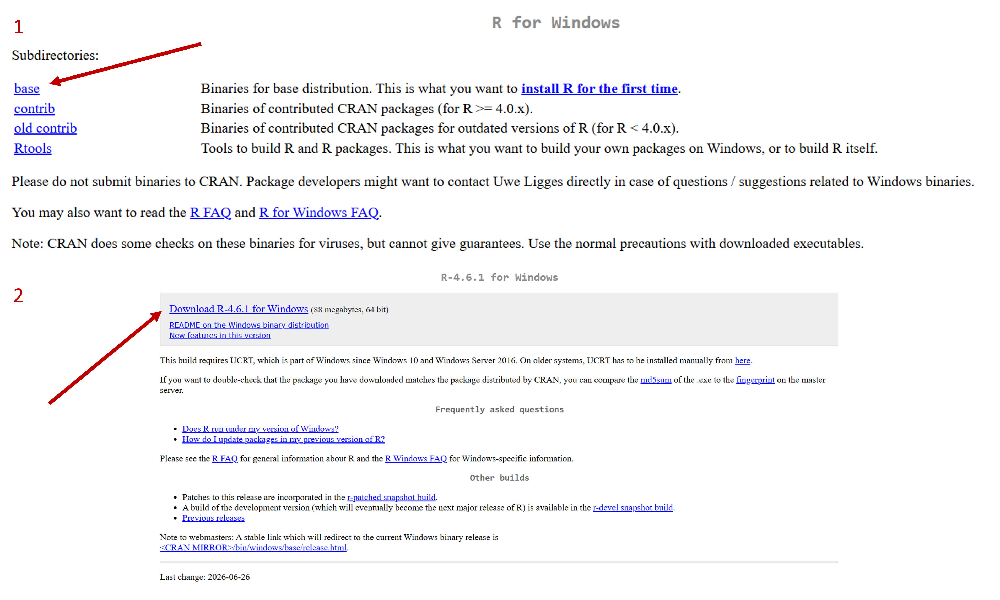
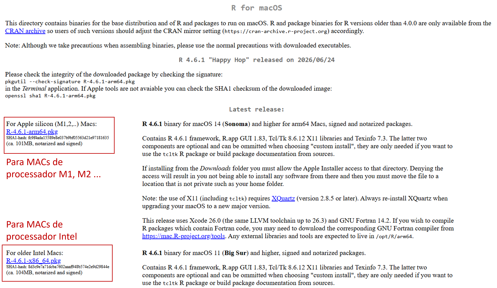
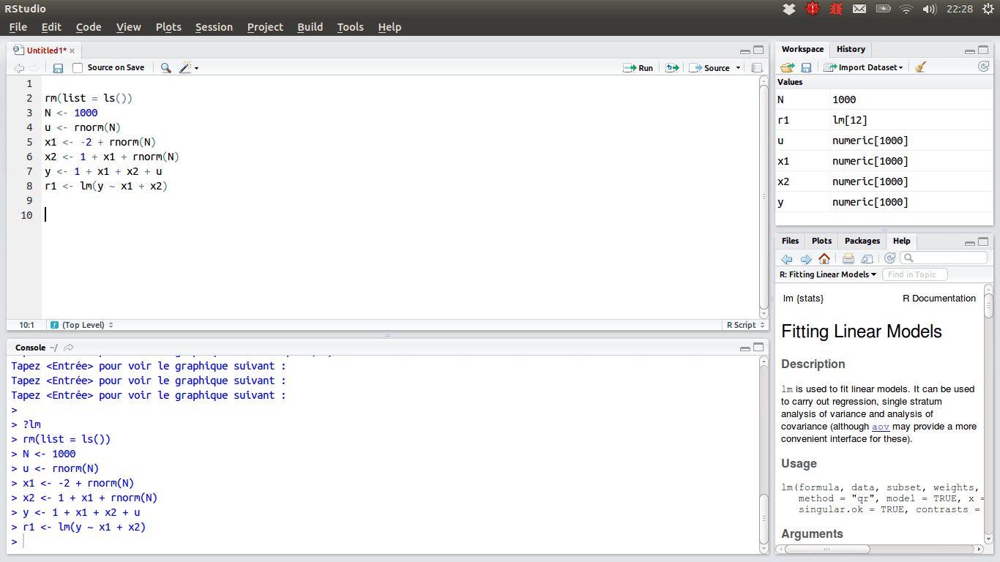

# Capa {.cover-slide background-color="#FFFFFF"}

::: cover-bg
:::

:::: {.cover-block .top}
[MINICURSO]{.cover-label}

::: cover-title
Análises geográficas a partir de bases públicas de dados: fundamentos e fontes teóricas
:::
::::

:::: {.cover-block .bottom}
[OFICINA]{.cover-label}

::: cover-title
Introdução ao uso da linguagem de programação R para tratamento de grandes bases de dados georreferenciadas
:::
::::

## Apresentação {.smaller}

::::::::::: theme-section
:::::::::: columns
::::: {.column width="47%"}
::: bio-name
Clara Penz
:::

[clarapenz\@usp.br](mailto:clarapenz@usp.br){.bio-email}

::: bio-text
Geógrafa, mestranda em Geografia Humana pela USP; atua com metodologias quantitativas para mapeamento e análise de políticas públicas. Participa do projeto "Redes técnicas e digitalização do território nas favelas", desenvolvido pelo CEFAVELA (UFABC); atualmente é estagiária no Instituto de Estudos Brasileiros (USP) no acervo do Milton Santos.
:::
:::::

::: {.column width="6%"}
:::

::::: {.column width="47%"}
::: bio-name
João Victor Pavesi de Oliveira
:::

[joao.pavesi\@gmail.com](mailto:joao.pavesi@gmail.com){.bio-email}

::: bio-text
Geógrafo, com mestrado e doutorado em Geografia Humana pela USP; estuda políticas educacionais, direito à cidade e geografia da educação. Participante da Rede Escola Pública e Universidade (REPU); atualmente professor substituto no IFBA-Salvador.
:::
:::::
::::::::::
:::::::::::

# MINICURSO {.green-slide background-color="#1B4332"}

:::: green-content
[MINICURSO]{.cover-label}

::: theme-section
Análises geográficas a partir de bases públicas de dados: fundamentos e fontes teóricas
:::
::::

## Bullets

::: theme-section
When you click the **Render** button a document will be generated that includes:

-   Content authored with markdown
-   Output from executable code
:::

## Line Highlighting

::: theme-section
-   Highlight specific lines for emphasis
-   Incrementally highlight additional lines

``` {.python code-line-numbers="4-5|7|10"}
import numpy as np
import matplotlib.pyplot as plt
r = np.arange(0, 2, 0.01)
theta = 2 * np.pi * r
fig, ax = plt.subplots(subplot_kw={'projection': 'polar'})
ax.plot(theta, r)
ax.set_rticks([0.5, 1, 1.5, 2])
ax.grid(True)
plt.show()
```
:::

::: footer
Learn more: [Line Highlighting](https://quarto.org/docs/presentations/revealjs/#line-highlighting)
:::

## Executable Code

::: theme-section
```{r}
#| echo: true
#| fig-width: 10
#| fig-height: 4.5
plot(cars)
```
:::

::: footer
Learn more: [Executable Code](https://quarto.org/docs/presentations/revealjs/#executable-code)
:::

## LaTeX Equations

:::::: theme-section
[MathJax](https://www.mathjax.org/) rendering of equations to HTML

::::: columns
::: {.column width="40%"}
``` tex
\begin{gather*}
a_1=b_1+c_1\\
a_2=b_2+c_2-d_2+e_2
\end{gather*}
\begin{align}
a_{11}& =b_{11}&
  a_{12}& =b_{12}\\
a_{21}& =b_{21}&
  a_{22}& =b_{22}+c_{22}
\end{align}
```
:::

::: {.column width="60%"}
\begin{gather*}
a_1=b_1+c_1\\
a_2=b_2+c_2-d_2+e_2
\end{gather*} \begin{align}
a_{11}& =b_{11}&
  a_{12}& =b_{12}\\
a_{21}& =b_{21}&
  a_{22}& =b_{22}+c_{22}
\end{align}
:::
:::::
::::::

::: footer
Learn more: [LaTeX Equations](https://quarto.org/docs/authoring/markdown-basics.html#equations)
:::

## Column Layout {.smaller}

::::::: theme-section
Arrange content into columns of varying widths:

:::::: columns
::: {.column width="35%"}
#### Motor Trend Car Road Tests

The data was extracted from the 1974 Motor Trend US magazine, and comprises fuel consumption and 10 aspects of automobile design and performance for 32 automobiles.
:::

::: {.column width="3%"}
:::

::: {.column width="62%"}
```{r}
plot(cars)
```
:::
::::::
:::::::

# OFICINA {.green-slide background-color="#1B4332"}

:::: green-content
[OFICINA]{.cover-label}

::: theme-section
Introdução ao uso da linguagem de programação R para tratamento de grandes bases de dados georreferenciadas
:::
::::

## Objetivos

-   Compreender o que é uma linguagem de programação

-   Reconhecer os diferentes painéis do R

-   Conhecer as principais funções para trabalhar com tabelas

    ::::: columns
    ::: {.column width="50%"}
    -   Importação
    -   Visualização
    -   Estatística básica
    :::

    ::: {.column width="50%"}
    -   Filtro
    -   Agrupamento
    -   União
    -   Exportação
    :::
    :::::

::: {.fragment .text-right}
*E, principalmente...*
:::

::: {.fragment .text-right}
*perder o medo de programar!*
:::

## O que é uma linguagem de programação?

::::::::: theme-section
:::::::: columns
:::: {.column width="48%"}
::: def-card
**Algoritmo**

Sequência lógica de passos para realizar uma tarefa computacional
:::
::::

::: {.column width="4%"}
:::

:::: {.column width="48%"}
::: def-card
**Linguagem de programação**

Conjunto formal de símbolos e regras utilizado para criar algoritmos
:::
::::
::::::::
:::::::::

## Metáfora da receita de bolo

::::::::: theme-section
:::::::: r-stack
:::::: {.fragment .fade-out fragment-index="1"}
::::: columns
::: {.column width="50%"}
-   Ovos fresquinhos
-   Pitada de sal
-   Açúcar a gosto (mas não exagerar!)
-   Farinha soltinha
:::

::: {.column width="50%"}
-   Qualquer óleo vegetal
-   Forno já quente
-   Assar até a casa cheirar a bolo
:::
:::::
::::::

::: {.fragment fragment-index="1"}
1.  Pré-aqueça o forno a 180°C
2.  Bata 3 ovos com 200 g de açúcar por 3 minutos
3.  Adicione 100 ml de óleo vegetal e bata por mais 1 minuto
4.  Incorpore 250 g de farinha de trigo e 10 g de fermento em pó, mexendo por 30 segundos
5.  Despeje em forma untada de 20 cm e leve ao forno por 35 minutos
6.  Retire quando um palito inserido no centro sair limpo
:::
::::::::
:::::::::

## Metáfora da receita de bolo

-   **Algoritmo:** receita em si, sequência de passos (misturar, acrescentar, assar)
-   **Linguagem de programação:** o idioma e a linguagem de comunicação da receita

::: {.fragment .text-right}
*Lembrando que o computador é um objeto literal!*
:::

## Por que escolher R? {.theme-section .smaller}
::::: {layout="[80,20]" layout-valign="center"}
::: {}
> "Acreditamos fortemente que é melhor dominar uma ferramenta de cada vez, e o R é um ótimo lugar para começar."
>
> - Hadley Wickham, Mine Çetinkaya-Rundel & Garrett Grolemund, *R for Data Science* (2ª ed., tradução livre)

-   Linguagem gratuita e de código aberto
-   Criada especificamente para estatística e análise de dados
-   Grande comunidade ativa (tidyverse, CRAN, fóruns)
-   Exige menos capacidade computacional que softwares pagos
:::
::: {}
{fig-align="center" width="45%"}
:::
:::::

## Instalação do R

Acesse o site da CRAN e faça download conforme o sistema operacional do seu computador, seguindo as especificações dos próximos slides

::: center-x
<iframe src="https://cran.r-project.org/" width="700" height="394">

</iframe>
:::

## Windows



Após o download, instalar normalmente clicando no arquivo baixado. Manter as especificações da instalação conforme o padrão.

## Mac



Assim como no Windows, instalar normalmente clicando no arquivo baixado. Manter as especificações da instalação conforme o padrão.

## Linux

O Sistema Linux pode variar conforme a especificação (Ubuntu, Debian...)

-   Vídeo-tutorial para instalação no Ubuntu:

::: center-x

:::

## Instalar RStudio

-   Acessar o site da Posit

-   Fazer Download conforme sistema operacional desejado

-   Instalar normalmente, seguindo as configurações padrão de instalação

::: center-x
<iframe src="https://docs.posit.co/ide/user/#rstudio-ide-oss-downloads" width="700" height="394">

</iframe>
:::

## Painéis do RStudio {.theme-section .smaller}

::::: {layout="[70,30]" layout-valign="center"}
<div>

{fig-align="center" width="95%"}

</div>

<div>

**1. Script (Source)**

canto superior esquerdo

**2. Console**

canto inferior esquerdo

**3. Environment**

canto superior direito

**4. Files / Plots / Packages / Help**

canto inferior direito

</div>
:::::

## Tipos de arquivo

:::::::: columns
:::: {.column width="48%"}
**Dados tabulares** mais comuns

-   `.csv` - valores separados por vírgula
-   `.txt` - texto delimitado (tab, `;`)
-   `.xlsx` - planilhas Excel

::: center-x
{width="35%"}
:::
::::

::: {.column width="4%"}
:::

:::: {.column width="48%"}
**Dados espaciais** mais comuns

-   `.shp` - shapefile (ESRI)
-   `.gpkg` - GeoPackage

::: center-x
{width="35%"}
:::
::::
::::::::

## Arquivos que vamos usar {.smaller}
::: theme-section
::::: columns
::: {.column width="32%"}
::: def-card
**Dicionário de dados**

Arquivo único com a descrição de todas as variáveis do Censo

[Baixar →](https://ftp.ibge.gov.br/Censos/Censo_Demografico_2022/Agregados_por_Setores_Censitarios/)
:::
:::
::: {.column width="2%"}
:::
::: {.column width="32%"}
::: def-card
**Malha de setores (BA)**

Geometrias dos setores censitários da Bahia, em `.gpkg`

[Baixar →](https://ftp.ibge.gov.br/Censos/Censo_Demografico_2022/Agregados_por_Setores_Censitarios/malha_com_atributos/setores/gpkg/UF/BA/)
:::
:::
::: {.column width="2%"}
:::
::: {.column width="32%"}
::: def-card
**Agregados por setor**

Pasta com arquivos `.zip` - vamos usar o de Alfabetização (primeiro)

[Baixar →](https://ftp.ibge.gov.br/Censos/Censo_Demografico_2022/Agregados_por_Setor_csv/)
:::
:::
:::::
:::

## Organização de pastas {.smaller}

::::::: theme-section
> (...) os conjuntos de dados organizados são todos parecidos, mas cada conjunto de dados bagunçado é bagunçado à sua própria maneira."
>
> - Hadley Wickham, *Tidy Data* (2014)

:::::: columns
::: {.column width="48%"}
```         
projeto-alfabetizacao-ba/
├── processar_dados.R
├── 1-inputs/
│   ├── dicionario_de_dados_agregados_por_setores_censitarios_20260520.xlsx
│   ├── BA_setores_CD2022.gpkg
│   └── Agregados_por_setores_alfabetizacao_BR.csv
└── 2-outputs/
```
:::

::: {.column width="4%"}
:::

::: {.column width="48%"}
-   **`inputs/`** - dados brutos, nunca editados manualmente
-   **`outputs/`** - resultados ou dados editados
-   **arquivo `.R`** - script
:::
::::::
:::::::

## Tabelas, variáveis e classes {.smaller}
::: theme-section
Uma **tabela** (*data frame*) organiza os dados em linhas e colunas. 

Cada coluna é uma **variável**. 

Cada variável tem uma **classe** (tipo de valor que ela armazena)

::::: columns
::: {.column width="40%"}
**Principais classes**

- `character` - texto

- `integer` / `numeric` - números

- `logical` - `TRUE` ou `FALSE`

- `factor` - categorias

**Exemplo:** `month.name` e `airquality`, dados prontos do R

```{r}
#| echo: true
#| eval: false
class(airquality$Ozone)  # integer
class(airquality$Wind)   # numeric
class(month.name)        # character
```
:::
::: {.column width="4%"}
:::
::: {.column width="56%"}
```{r}
#| echo: true
#| eval: true
month.name
head(airquality)
```
:::
:::::
:::

## Pacotes em R {.smaller}

::::::: theme-section
Um **pacote** é um conjunto de funções, dados e documentação que estende as capacidades do *R base*

Instalar: `install.packages()` (uma vez)

Carregar: `library()` (a cada sessão)

:::::: columns
::: {.column width="48%"}
**Manipulação de dados**

-   `dplyr` - filtrar, agrupar, unir

-   `readxl` - importar e exportar dados em planilhas de excel

-   `stringr` - editar e manipular dados textuais
:::

::: {.column width="4%"}
:::

::: {.column width="48%"}
**Dados espaciais**

-   `sf` - dados vetoriais georreferenciados
:::
::::::

```{r}
#| echo: true
#| eval: false
install.packages("dplyr")
install.packages("stringr")
install.packages("readxl")
install.packages("sf")

library(dplyr)
library(stringr)
library(readxl)
library(sf)
```
:::::::

## Importação {.smaller}

::: theme-section
```{r}
#| echo: true
#| eval: false
# ler geopackage de setores censitários da Bahia
malha_ba <- st_read("1-inputs/BA_setores_CD2022.gpkg")

# ler arquivo .csv de alfabetização por setor censitário
alfabetizacao <- read.delim("1-inputs/Agregados_por_setores_alfabetizacao_BR.csv", sep = ";")
```
:::

## Visualização {.smaller}
::: theme-section
Checagem básica de estrutura dos dados
```{r}
#| echo: true
#| eval: false
head(alfabetizacao)
tail(alfabetizacao)
names(alfabetizacao)
str(alfabetizacao)
```

No dicionário do IBGE, três colunas serão nosso foco:

-   `CD_SETOR` - código único de cada setor censitário

-   `V00900` - pessoas de 15 anos ou mais que sabem ler e escrever

-   `V00901` - pessoas de 15 anos ou mais que não sabem ler e escrever

:::

## Filtro {.smaller}

::: theme-section
O CSV do IBGE vem para o Brasil todo - manter apenas os setores da Bahia

⚠️ Atenção especial ao `CD_SETOR`: precisa ser lido como **texto** (`character`), nunca como número!
:::
```{r}
#| echo: true
#| eval: false
alfabetizacao <- alfabetizacao %>%
  mutate(CD_SETOR = as.character(CD_SETOR))

# filtrar a coluna CD_SETOR para os registros que começam com 29 - código estadual da Bahia
alfabetizacao_ba <- alfabetizacao %>%
  filter(str_starts(CD_SETOR, "29"))

# remover planilha de Brasil inteiro (liberar memória)
rm(alfabetizacao)
```
:::

## Estatística básica {.smaller}

::: theme-section
Agora calculamos, para cada setor: o total de pessoas de 15 anos ou mais, quantas não sabem ler, e o percentual de analfabetismo.

```{r}
#| echo: true
#| eval: false
alfabetizacao_ba <- alfabetizacao_ba %>%
  mutate(
    total_15mais       = V00900 + V00901,
    nao_alfabetizados  = V00901,
    pct_analfabetismo  = (V00901 / total_15mais) * 100
  )

summary(alfabetizacao_ba$pct_analfabetismo)
```
:::

## União {.smaller}

::: theme-section
Por fim, unimos a tabela tratada à malha espacial, usando o código do setor censitário como chave:

```{r}
#| echo: true
#| eval: false
dados_geo <- malha_ba %>%
  left_join(alfabetizacao_ba, by = "CD_SETOR")
```

Com isso, cada setor da malha passa a carregar o percentual de analfabetismo - pronto para virar mapa.
:::

# Agradecemos! {.thanks-slide background-color="#1B4332"}
